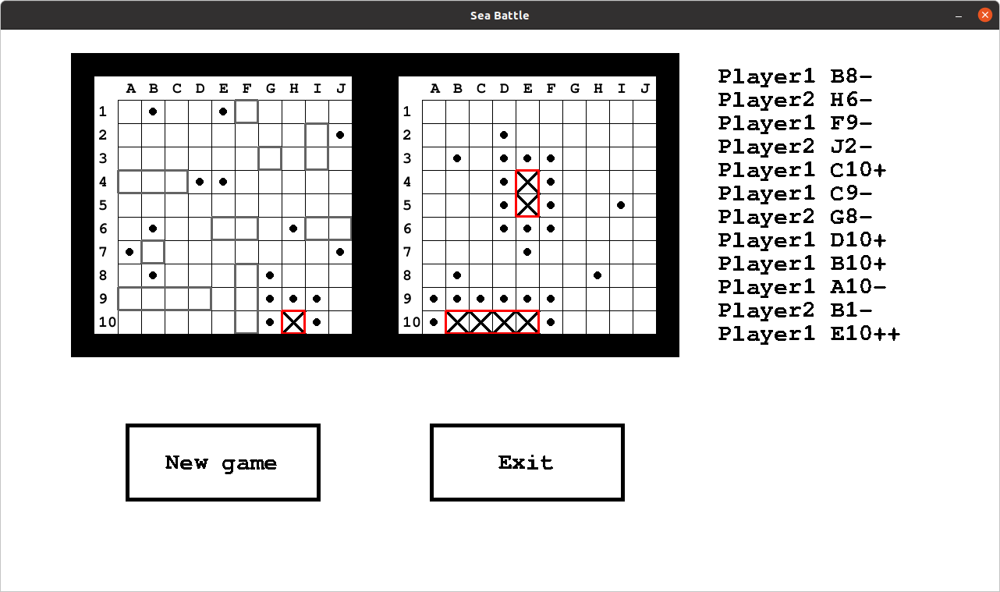

# SeaBattle
Морской бой на Python3 с использованием библиотеки pygame

## Постановка задачи
Написать игру "Морской бой" на Python3 с использованием pygame.

**Базовая функциональность**:
* Расстановка кораблей, после установки последнего автоматически начинается игра
* Возможность осуществлять выстрел и видеть выстрелы соперника
* Игра идёт против ИИ
* Журнал выстрелов, заполняющийся автоматически
* Автоматическое выделение пустых полей, когда становится ясно, что они пусты (например, вокруг однопалубного корабля, когда он уничтожен)

**Возможная дополнительная функциональность**:
* Возможность отмечать предположительно пустые клетки самим игроком
* Возможность устанавливать любой состав кораблей перед началом игры
* Возможность игры двух игроков на одном компьютере
* Возможность игры двух игроков по сети
* Выбор уровня сложности для ИИ
* Рейтинговые игры при игре по сети

## Интерфейсная модель
Пример интерфейса

